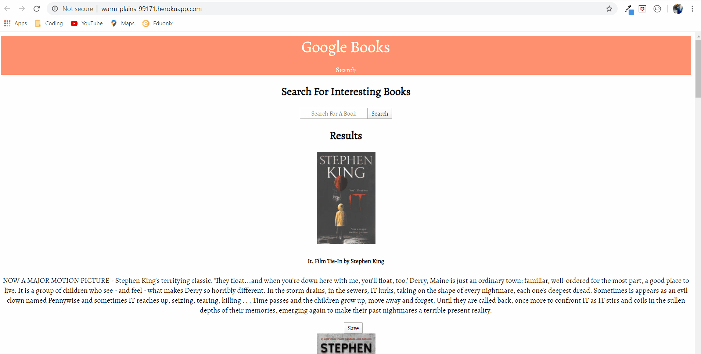

# googleBooks
This repository ("googleBooks") is an application that gives users the option to search Google Books API which then provides the book title, author, and a short summary. Additionally, users can save books to a depository for future access. 

## Installation

The application is deployed using github and heroku. The main page can be opened in the browser. The user will be presented with a search bar, and the results of a given book IT by Stephen King. 

## User Story
**As an** avid reader\
**I want** to be able to view multiple books\
**So that** I can choose my next read easily

## Built With
[React.js](https://reactjs.org/docs/getting-started.html) -Backend development language\
[Bootstrap](https://getbootstrap.com/docs/4.1/getting-started/introduction/) -Page rendering template\
[JavaScript](https://developer.mozilla.org/en-US/docs/Web/JavaScript) -Frontend development language and server usage\
[Heroku](https://devcenter.heroku.com/categories/reference) -App deployment using github master branch\

## Credits

I was the creator of the main application and repository. For help when facing obstacles I leaned on my friend Blake, and my friend Chris. Blake is a programmer with 7+ years in the business, and Chris is a work friend who is a fantastic problem solver. I also used YouTube to find different videos on React, JSX, JavaScript, Node.js, routes,and various troubleshooting tips.

